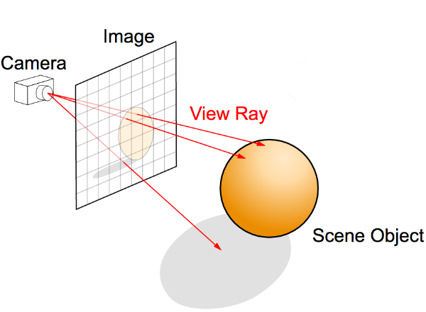
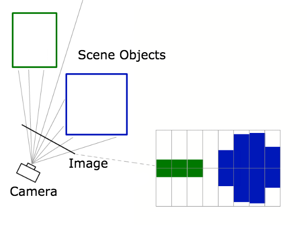
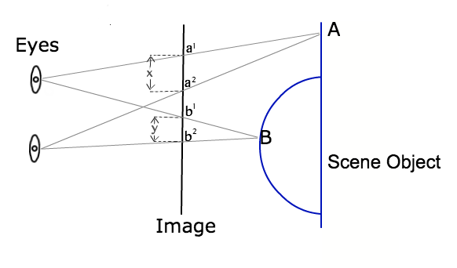

# Random dot stereogram raycaster

This is a real-time 3D engine (ray caster) that renders to single-image random-dot stereogram (the images made popular in the Magic Eye books). I wrote this because I was curious if the brain would be able to follow a stereogram in motion. Click on the screen and press 3 after the program starts to render in stereogram. Let me know what you think!

# [Give it a try here](https://ammonb.github.io/stereogram-raycaster/)

## Controls

The program initially renders in color. You can change the render mode (to color, depth map or stereogram) by pressing 1, 2 or 3. In the game, navigate with the arrow keys, and jump with the space bar. If you hold down the 'e' key, you can use the arrow keys to modify the block in front of you.

## Raycasting

Raycasting is an algorithm for rending 3D (or pseudo-3D) geometry. It was made famous by Wolfenstein 3D and Doom. The core algorithm is delightfully simple (you can write a working renderer in about 20 lines). The best way to understand ray casting is to view it as a simplification of ray tracing.

In ray tracing, rays are 'traced' from the location of a camera in a scene out into the world. One ray is calculated for each pixel in the output image. All the render needs to do, then, is calculate what color object each ray intersects first, and draw a pixel of that color. The following images (from Wikipedia) shows the idea.

This algorithm produces beautiful renderings, but is computationally expensive.

Raycasting is an optimization on this idea. Rather than calculate a ray per pixel, a raycaster calculates a ray per column of pixels, and reconstructs the column of pixels by considering the length of the ray. As long as the geometry satisfies certain constraints, this works like a charm, and is dramatically faster. To understand how this works, imagine a simple block maze like Wolfenstein 3D.

Notice that all walls are vertical and of constant height, with the camera at the midpoint on the walls. This means that the rendered image is vertically symmetrical. As we draw this image, than, all we need to know is the height and color of the line to draw in each column. By perspective math, this height is simply the original wall height divided by the distance to the wall (or length of the ray cast for each column). The following image shows this.

The rendering loop used to draw the above image looks like

    for (var x = 0; x < SCREEN_WIDTH; x++) {
        // camera_heading + FOV * x / SCREEN_WIDTH;
        var angle = angleForColumn(x);

        // calculate distance to wall from camera position at given angle
        var [color, distance] = castRay(angle);

        // draw wall slice
        var h = WALL_HEIGHT / distance;
        drawLine(x, SCREEN_HEIGHT/2 - h, x, SCREEN_HEIGHT/2 + h, color);
    }

This basic idea can be extended to support arbitrary wall heights, horizontal surfaces, and vertical motion by the camera (as it is in the game Doom, and my raycaster above). To understand how this works, look at a snippet of the rendering loop above

    // draw wall slice
    var h = WALL_HEIGHT / distance;
    drawLine(x, SCREEN_HEIGHT/2 - h, x, SCREEN_HEIGHT/2 + h, color);

This can be re-written

    var h1 = CAM_HEIGHT - WALL_HEIGHT / 2;
    var d1 = distance;

    var h2 = CAM_HEIGHT + WALL_HEIGHT / 2;
    var d2 = distance;

    var y1 = h1 / d1;
    var y2 = h2 / d2;

    drawLine(x, y1, x, y2, color);

Here we have two points intersecting the ray we've cast, essentially defined in cylindrical coordinates (the angle of the ray, the distance to each point, and the height of each point). We then convert both points to screen coordinates by dividing the height by the distance, and draw a line between them. This works for the top and bottom of a wall (as we've already seen). But it works equally well for horizontal surfaces. Occlusion obviously becomes an issue, but this is easily handled by drawing back to front (or drawing front to back, disallowing transparency, and clamping all y values at the min seen so far).

I've totally ignored the issue of how you actually calculate ray/world intersections. You can read more about that [here] (http://lodev.org/cgtutor/raycasting.html).

## Random dot stereograms

Stereograms are images (or pairs of images) that provide the illusion of a 3D scene with depth perception. The simplest way to do this is to show a separate image to each eye. Then, differences in the location of features in each image can provoke depth perception. This works, but requires an optical apparatus (like Google cardboard, or polarized light and 3D glasses) to view the two images.

Random dot stereograms are stereograms where the images are seemingly random patterns of dots. Each image by itself shows nothing. However, a pair of random-dot images viewed as a stereogram can still provoke depth perception. Differences in the positions of the almost-random dots create depth perception without any color information.

Random dot stereograms do not require a pair of images. This is the idea of a single-image random dot stereogram. Such an image uses a repetitive pattern of dots, similar to a chain link fence. The viewer can then spread or cross their eyes when viewing the image, and trick their brain into thinking that both eyes are focusing on the same spot when they are in fact offset by the width of the repeating pattern. Modifications to successive columns of the pattern can then create different angles between apparent features, and provoke depth perception.

To understand the algorithm, consider the following diagram.

This diagram shows a pair of eyes focusing on a 3D scene. Between the eyes and the scene, we again have an image plane (just as we did for the raycaster). However, this time, the goal is represent not color information, but stereoscopic depth information. How can we do this? Consider points A and B in the digram. These are points on the surface of the 3D geometry that we are rendering. When both eyes focus on point A, the line from each eye passes through a different point in the image plane. Specifically, the line from the left eye passes through the point a1, and the line from the right eye passes through a2. If our image represents this scene, then, p1 and p2 must have the same color. Now consider point B on the scene. Again, the lines from the eyes pass through two points (b1 and b2). So points b1 and b2 must be the same color. We can repeat this exercise for every point on the surface of the geometry we are rendering, and the result will be a list of constraints on the output image (pairs of pixels that must be equal). All it takes to render a stereogram is to produce an image that satisfies these constraints (the degenerate case of setting all pixels to the same color is not a very interesting, however).

Solving the constraints is not hard. However, it will be a per-pixel operation (like ray tracing) not a per-column operation like raycasting. First, we need a way to calculate the distance between pairs of linked pixels, as a function of the z value at a given point (the values x and y from the digram). By similar triangles, we get

    constraint_separation  = (EYE_SEPERATION * z) / (1 + z)

where EYE_SEPERATION is the distance between our eyes (in pixels), and z is the depth of the scene at the point in question, measured in distance from the image plane, in multiples of the distance from our eyes to the image plane.

Because all constraints are between pairs of pixels in the same row, we can consider the algorithm one row at a time. For each row of pixels in the image, then, we create an array to store constraints, where we map each index pixel to an earlier pixel

    var constraints = Array(SCREEN_WIDTH);

And fill in the constraints as follows

    for (var x = 0; x < SCREEN_WIDTH; x++) {
        // get the z for xth pixel in the row
        var z = getZ(x, row);

        // distance between the image points linked by this z value
        var separation = (EYE_SEPERATION * z) / (1 + z);

        // the two linked points
        var p1 = x - Math.floor(separation/2);
        var p2 = p1 + Math.floor(separation);

        // if they're in range, record that p2 must equal p1
        if (p1 >= 0 && p2 < SCREEN_WIDTH) {
            constraints[p2] = p1;
        }
    }

Then, all we have to do is scan left to right, and check the constraints. If a pixel is unconstrained, set it to a random value. Otherwise, copy the value from earlier in the image

    for (var x = 0; x < SCREEN_WIDTH; x++) {
        if (constraints[x] === undefined) {
            putPixel(x, y, randomColor());
        } else {

            // get the color of the pixel pointed to by our constraint
            var c = getPixel(constraints[x], y);

            // and output that color
            putPixel(x, y, c);
        }
    }

That's it! You can read in more detail about stereograms [here](http://www.cs.waikato.ac.nz/~ihw/papers/94-HWT-SI-IHW-SIRDS-paper.pdf).
