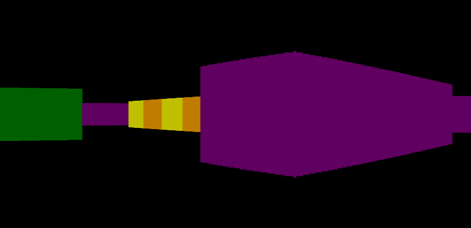
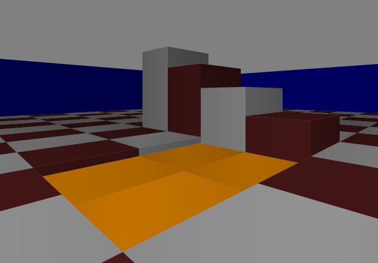

# Random dot stereogram raycaster

This is a real-time 3D engine (ray caster) that renders to single-image stereogram (the images made popular in the Magic Eye books). You can give it a try [here](https://ammonb.github.io/stereogram-raycaster/). I wrote this because I was curious if the brain would be able to follow a motion stereogram. Click on the screen and press 3 after the program starts to render in stereogram. Let me know what you think!

## Controls

The program initially renders in color. You can change the render mode (to color, depth map or autostereogram) by pressing 1, 2 or 3. In the game, navigate with the arrow keys, and jump with the space bar. If you hold down the 'e' key, you can use the arrow keys to modify the block in front of you.

## Raycasting

Raycasting is an algorithm for rending 3D (or pseudo-3D) geometry. It was made famous by Wolfenstein 3D and Doom. The core algorithm is delightfully simple (you can write a working renderer in about 20 lines). The best way to understand ray casting is to view it as a simplification of ray tracing.

In ray tracing, rays are 'traced' from the location of a camera in a scene out into the world. One ray is calculated for each pixel in the output image. All the render needs to do, then, is calculate what color object each ray intersects first, and draw a pixel of that color. The following images (from Wikipedia) shows the idea.

This algorithm produces beautiful renderings, but is computationally expensive.

Raycasting is an optimization on this idea. Rather than calculate a ray per pixel, a raycaster calculates a ray per column of pixels, and reconstructs the column of pixels by considering the length of the ray. As long as the geometry satisfies certain constraints, this works like a charm, and is dramatically faster. To understand how this works, imagine the simple case of world like Wolfenstein 3D.

Notice that all walls are vertical and of constant height, with the camera at the midpoint on the walls. This means that the rendered image is vertically symmetrical. As we draw this image, than, all we need to know is the height and color of the line to draw in each column. By perspective math, this height is simply the original wall height divided by the distance to the wall (or length of the ray cast for each column).

For example the rendering loop used to draw the above image looks like

    for (var x = 0; x < SCREEN_WIDTH; x++) {
        // camera_heading + FOV * x / SCREEN_WIDTH;
        var angle = angleForColumn(x);

        // calculate distance to wall from camera position at given angle
        var [color, distance] = castRay(angle);

        // draw wall slice
        var h = WALL_HEIGHT / distance;
        drawLine(x, SCREEN_HEIGHT/2 - h, x, SCREEN_HEIGHT/2 + h, color);
    }

This basic idea can be extended to support arbitrary wall heights, horizontal surfaces, and vertical motion by the camera (as it is in the game Doom, and my raycaster above). To understand how this works, look at snippet of the rendering loop above

    // draw wall slice
    var h = WALL_HEIGHT / distance;
    drawLine(x, SCREEN_HEIGHT/2 - h, x, SCREEN_HEIGHT/2 + h, color);

This can be re-written

    var h1 = CAM_HEIGHT - WALL_HEIGHT / 2;
    var d1 = distance;

    var h2 = CAM_HEIGHT + WALL_HEIGHT / 2;
    var d2 = distance;

    var y1 = h1 / d1;
    var y2 = h2 / d2;

    drawLine(x, y1, x, y2, color);

Here we have two points intersecting the ray we've cast, essentially defined in cylindrical coordinates (the angle of the ray, the distance to each point, and the height of each point). We then convert both points to screen coordinates by dividing the height by the distance, and draw a line between them. This works for the top and bottom of a wall (as we've already seen). But it works equally well for horizontal surfaces. Occlusion obviously becomes an issue, but this is easily handled by drawing back to front (or drawing front to back, disallowing transparency, and clamping all y values at the min seen so far).

I've totally ignored the issue of how you actually calculate ray intersections. You can read more about that here [here] (http://lodev.org/cgtutor/raycasting.html).

## Random dot stereograms

Stereograms are images (or pairs of images) that provide the illusion of a 3D scene with depth perception. The simplest way to do this is to show a separate image to each eye. Then, differences in the location of features in each image can provoke depth perception. This works, but requires an optical apparatus (like Google cardboard, or polarized light and 3D glasses) to view the two images.

Random dot stereograms are stereograms where the images are seemingly random patterns of dots. Each image by itself shows nothing. However, a pair of random-dot images viewed as a stereogram can still provoke depth perception. Differences in the positions of the almost-random dots create depth perception without any color information.

Random dot stereograms do not require a pair of images. This is the idea of a single-image random dot stereogram. Such an image uses a repetitive pattern of dots, similar to a chain link fence. The viewer can then spread or cross their eyes when viewing the image, and trick their bring into thinking that both eyes are focusing on the same spot when they are in fact offset by the width of the repeating pattern. Modifications to successive columns of the pattern can then create different angles between apparent features, and provoke depth perception.

[here](http://www.cs.waikato.ac.nz/~ihw/papers/94-HWT-SI-IHW-SIRDS-paper.pdf).
